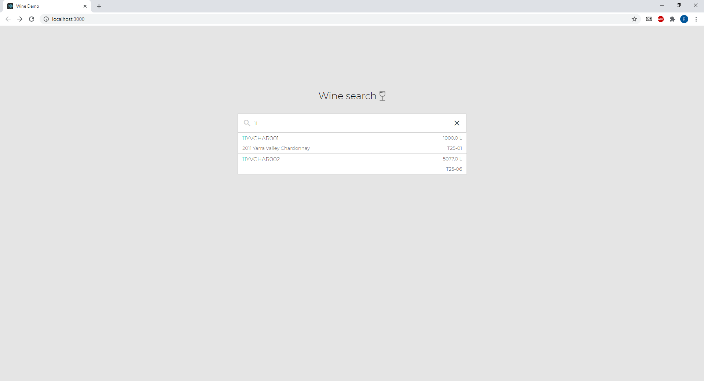
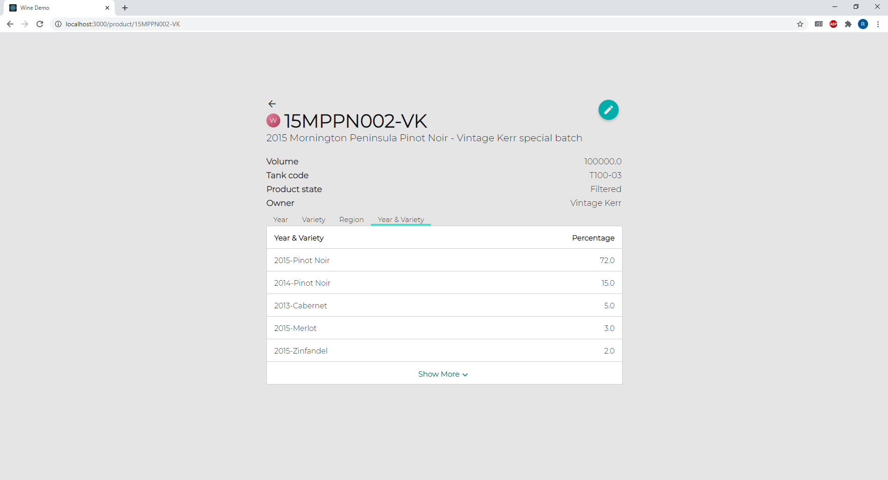

# wine-demo

Code Challenge

Summary
1. Spring Boot / Java
First time using spring boot. Created a few basic querys. Just uses an Arraylist to store the data so not very scalable.
2. React
Basic wine searching app. Uses the querys created using Spring boot. Particularly enjoyed this part. As not very large the components are only coded in 2 files.

How to run:

install yarn
install react

open wine-demo-react folder
yarn install
yarn start

open Exercise1 folder
install maven dependencys from pom
open src\main\java\com\spring\rest folder
run Application.java

if the localhost port used is different to 8080 and 3000
reactHost in the WineController.java file in Exercise1 and the apihost in configurations.js in wine-demo-react will need to be changed.

Improvements:
- A more scalable way of storing and sorting the data could be used in Exercises1. A simple ArrayList was used to store the data for simplicity.
- Lazy loading could be implemented in the querys for queries with large amounts of data. 
- For a larger project, the react components should be split into smaller components such as the table within the product page and to improve the organisation of the folders.
- See more could be made more advanced to implement lazy loading, a simple counter was used in the creation of the current one.

